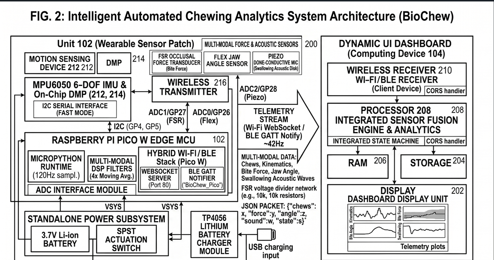

## 🔌 Hardware Schematics & Pin Mapping

The system utilizes the internal peripherals of the Raspberry Pi Pico W, mapping the multi-modal sensor matrix directly via I2C Fast Mode and analog-to-digital converter (ADC) channels.

### 📌 Explicit Pin Reference Table
| Sensor Component | Physical Transducer | Pico W Pin Assignment | Signal/Protocol Type |
| :--- | :--- | :--- | :--- |
| **Mandibular Kinematics** | MPU6050 6-DOF IMU | **GP4 (SDA), GP5 (SCL)** | I2C Hardware Bus (Fast Mode @ 400kHz) |
| **Jaw Opening Angle** | Flex Ribbon Sensor | **GP26 (ADC0)** | Analog Voltage Divider Pipeline |
| **Occlusal Bite Force** | Force Sensitive Resistor | **GP27 (ADC1)** | Analog Voltage Divider Pipeline |
| **Swallowing Acoustics** | Piezoelectric Ceramic Disk | **GP28 (ADC2)** | Analog High-Impedance Capture |
| **System Power Control** | SPST Latching Toggle Switch | **VSYS (Pin 39)** | Main Battery Isolation Rail |

---

### 🗺️ System Architecture Diagram

Below is the upgraded structural schematic of the multi-modal system, illustrating both the hard-wired analog-to-digital pipelines and the dual-wireless translation endpoints:

*Note: Ensure that the upgraded architecture block diagram image file is saved exactly as `block_diagram.png` inside your `hardware/` folder so it renders properly on the repository main page.*
## 📺 Project Demonstration

For a complete walkthrough of the hardware assembly, sensor fusion calibration calibration, and real-time state machine triggers, watch the live demonstration video:

👉 **[Click Here to Watch the BioChew Project Demonstration Video]
## 📺 Project Demonstration

For a complete walkthrough of the hardware assembly, sensor fusion calibration calibration, and real-time state machine triggers, watch the live demonstration video:

👉 **[Click Here to Watch the BioChew Project Demonstration Video]
https://1drv.ms/w/c/5a572c201e029e67/IQCIKkewXPyZSq_6kuEK7fr6ARm1TDRvbRL71UE_iVNho28?e=yisWkS

*(Includes live validation tracks for Solid Food 🍏, Soft Food 🥣, and premature swallowing alert triggers 🚨)*
